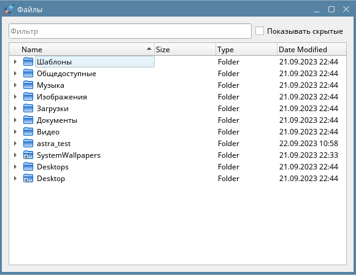
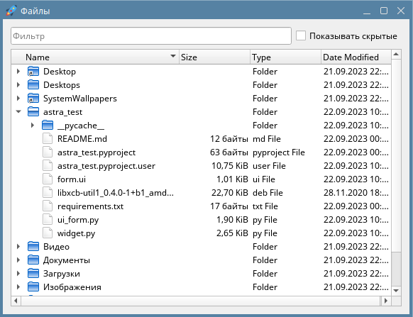
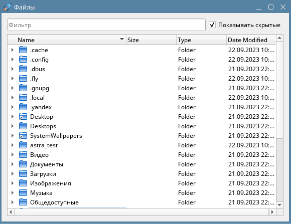
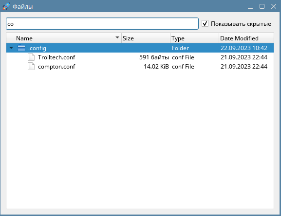

# astra_test






## Содержание
- [astra\_test](#astra_test)
  - [Содержание](#содержание)
  - [Требования](#требования)
  - [Установка](#установка)
  - [Запуск](#запуск)
  - [TODO](#todo)
  - [Проблемы](#проблемы)
    - [Не удалось загрузить плагин платформы Qt "xcb" в "", хотя он был найден.](#не-удалось-загрузить-плагин-платформы-qt-xcb-в--хотя-он-был-найден)
      - [Решение](#решение)
        - [Обновить ссылку](#обновить-ссылку)


## Требования

- Qt4
- Python 3.5.3
- PySide2

## Установка

0. ```bash
   git clone https://github.com/viktory683/astra_test.git
   cd astra_test
   ```
   1. (опционально) Создать виртуальное окружение
      ```bash
      python3 -m venv .venv
      source .venv/bin/activate
      ```
1. Установить необходимые зависимости
   ```bash
   pip3 install -r requirements.txt
   ```

## Запуск
В случае использования виртуального окружения
```bash
/path/to/venv/bin/python3 /path/to/prroject/directory/widget.py
```

При установке зависимостей в глобальном окружении
```bash
python3 /path/to/project/directory/widget.py
```

## TODO

- [ ] Переработать фильтрацию для исправление бага со сбросом корня дерева на фильтре, с которым нет соответствий, фильтре вида `"/"`
- [ ] Выровнять все колонны, кроме имени по правому краю

## Проблемы

### Не удалось загрузить плагин платформы Qt "xcb" в "", хотя он был найден.
оригинал: `Could not load the Qt platform plugin "xcb" in "" even though it was found.`

#### Решение

1. Скачать последнюю версию `libxcb-util1` (ссылка на скачивание действительна на текущий момент `22/09/2023`.
   
   В случае возникновения ошибки `404 Not Found` необходимо заменить её на актуальную ([См. ниже](#обновить-ссылку)))
   ```bash
   wget -O libxcb-util1.deb http://ftp.de.debian.org/debian/pool/main/x/xcb-util/libxcb-util1_0.4.0-1+b1_amd64.deb
   ```
2. Установить пакет
   ```bash
   sudo dpkg -i libxcb-util1.deb
   ```

##### Обновить ссылку

Поиск по запросу `libxcb-util1` на [сайте](https://debian.pkgs.org/12/debian-main-amd64)

Выбрать необходимый репозиторий и архитектуру (`Debian 11 > amd64` сработал)

Секция `Download > Binary Package`